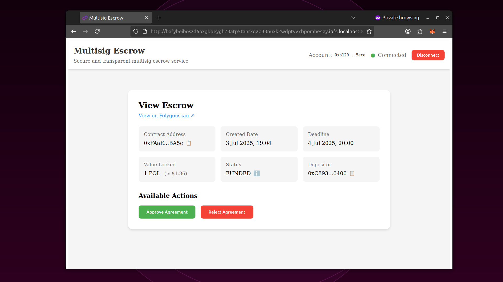
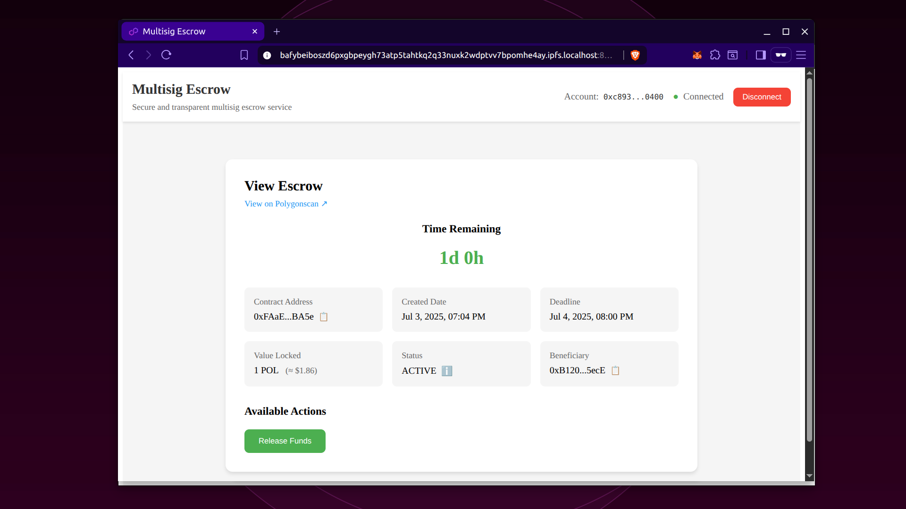

# Self-deployable Multisig Escrow 🏦
Simple escrow dapp with multisig disputes resolution

> [!Important]
> Also possible to use the live deployment on Polygon chain and the web app deployed to github pages and IPFS.

> [!Tip]
> Multisig could be crafted with **Gnosis Safe** 
>
> Also possible instead of multisig use an address of an aggreed **Artibrator**. 

## Live on Polygon chain 🔗

Contract address:
https://polygonscan.com/address/0xDF078a36C7ED2361Aa83846B6F9A3F76c98EE689

The web app deployed to github pages:
https://adellantado.github.io/simple-multisig-escrow/

IPFS deployment:
QmRUWNaP3kwV4iQnsRjp8cWYA4pg8ANZ3buMuAso3U8u1o

> [!Tip]
> To visit IPFS page please spin the local ipfs daemon first.
> For this you can execute: npm run open
>
> Make sure .env file contains correct IPFS_PAGE variable.

## Business logic of the Escrow Contract 🤝

> [!Note]
> The contract supports unlimited number of escrows.
> To navigate escrows use "View Escrow" menu

The MultisigEscrow contract implements a secure escrow system with the following workflow:

### 1. Agreement Creation & Funding
- **Depositor** creates an escrow agreement by calling the contract with ETH
- Agreement status becomes `Funded` (status 0)
- Depositor sets a deadline for delivery/completion
- Funds are locked in the contract

### 2. Beneficiary Response Period
- **Beneficiary** can either:
  - **Approve** the agreement → status becomes `Active` (status 1)
  - **Reject** the agreement → status becomes `Rejected` (status 2)
- **Depositor** can **revoke** the agreement before beneficiary responds → status becomes `Revoked` (status 3)

### 3. Active Agreement Management
Once approved, the agreement becomes active and both parties can:

**Beneficiary actions:**
- **Refund** the agreement → status becomes `Refunded` (status 4)
- **Release funds** after deadline + 3 days → status becomes `Closed` (status 5)

**Depositor actions:**
- **Release funds** immediately → status becomes `Closed` (status 5)

### 4. Dispute Resolution (Fund Locking)
If no agreement is reached by the deadline:
- **Depositor** can **lock funds** during a 3-day window after deadline
- Agreement status becomes `Locked` (status 6)
- **Beneficiary** sets a **multisig address** for dispute resolution
- **Depositor** must approve the multisig address
- Only the approved multisig can release funds to either party

### 5. Fund Withdrawal
- **Beneficiary** can withdraw funds from closed agreements
- **Depositor** can remove funds from revoked/rejected/refunded agreements
- All withdrawals use reentrancy protection for security

### Key Security Features
- **ReentrancyGuard**: Prevents reentrancy attacks
- **Pausable**: Contract can be paused in emergencies
- **Multicall**: Allows batch operations for efficiency
- **Access control**: Only authorized parties can perform actions
- **Time-based restrictions**: Enforces deadlines and waiting periods

## Deploy your own web app and/or contract 🧪
- Run npm install
- Deploy the factory contract to EVM compatible chain with Hardhat ignition (or use existing polygon contract)
- Create .env file with the factory address
- Deploy the web app to your server or to ipfs